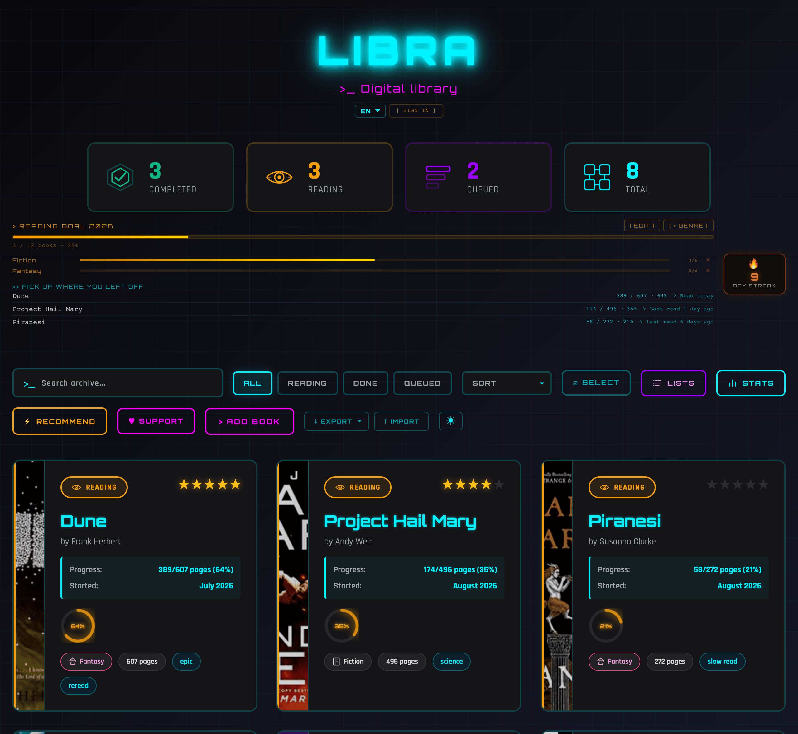
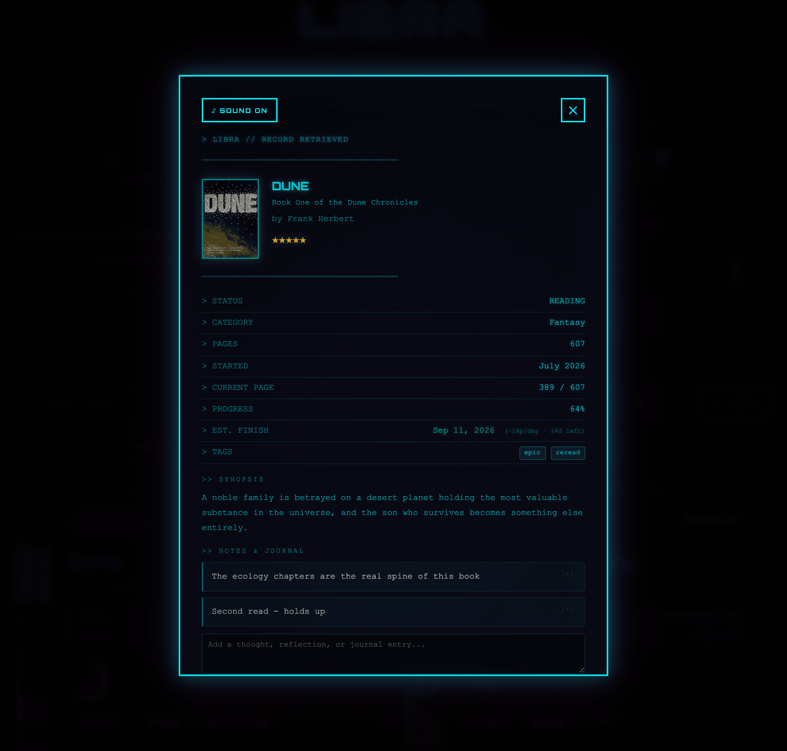
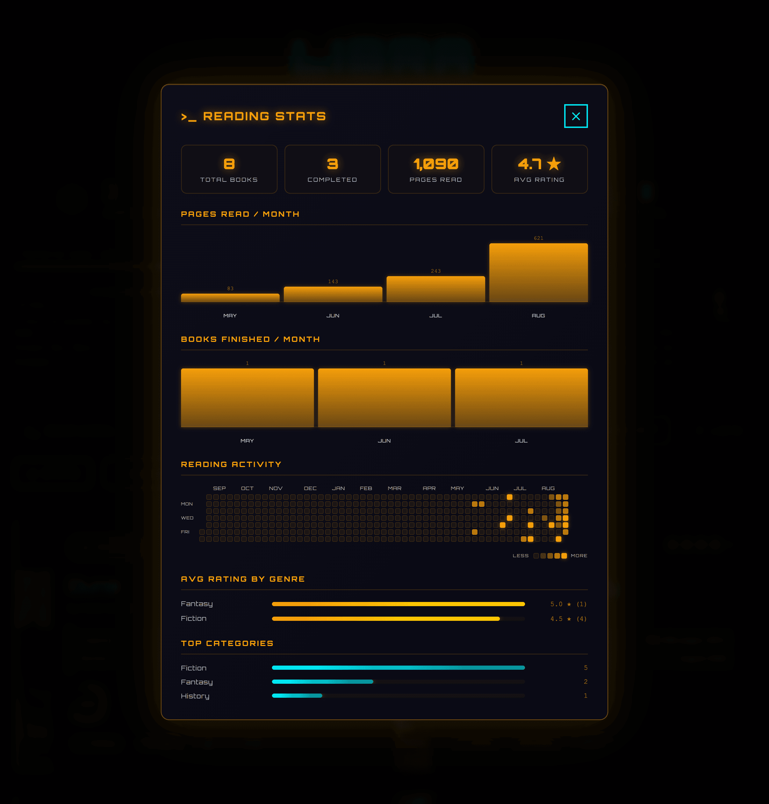
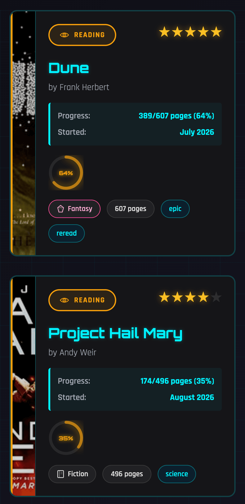

# Libra — Cyberpunk Reading Tracker

<div align="center">

[](https://buymeacoffee.com/laddtnov)

</div>

<div align="center">


A personal reading tracker with a full cyberpunk neon UI — glitch title, status-colored book spines, Open Library auto-fill, genre-based recommendations, cross-device cloud sync, and a full reading stats dashboard.

[🌐 Live Demo](https://libra.laddtnov.xyz/)

</div>

---

## 📸 Screenshots

<div align="center">



*Stats, reading goal with per-genre targets, continue-reading strip, streak badge, and the library grid — cover art fills each card's spine.*

</div>

<table>
<tr>
<td width="50%"></td>
<td width="50%"></td>
</tr>
<tr>
<td align="center"><em>Book detail — a terminal readout with pace estimate, tags, and journal</em></td>
<td align="center"><em>Stats — pages per month, books finished, 365-day activity heatmap</em></td>
</tr>
</table>

<div align="center">


*Responsive down to 375px*

</div>

---

## ✨ Features

### Core
- **Full CRUD** — add, edit, delete books with a cyberpunk form modal
- **Cloud sync** — sign in with email + password, books sync across all devices via Supabase
- **Offline first** — localStorage fallback when offline; syncs on reconnect; auto-pulls on tab focus
- **Open Library auto-fill** — search any title, auto-populate author, pages, cover, synopsis, genre
- **Stats cards** — Completed / Reading / Queued / Total with count-up animation
- **Custom tags** — tag books freely; search by tag name
- **Auto-complete** — book auto-marks as completed when session pages reach total

### Reading Goal & Streaks
- **Annual reading goal** — set a target, watch the neon progress bar fill up
- **Per-genre goals** — e.g. "Read 5 Fantasy books this year" with mini progress bars
- **Reading streaks** — consecutive days with sessions logged; flame badge with hover animation
- **Milestone toasts** — fire at 7, 14, 30, 60, 100-day streaks
- **Continue reading** — your three most recently touched books, each with its page count and how long since you last opened it; click one to jump straight into it

### Reading Timer & Sessions
- **Reading timer** — start/pause/stop timer in session log; elapsed minutes saved with session
- **Reading Session Log** — log date + pages; drives the progress ring automatically
- **Pace estimator** — calculates avg pages/day from sessions → estimated finish date

### Stats Dashboard
- **Reading activity heatmap** — a rolling 365 days of sessions, GitHub-style, shaded by pages read
- Pages read per month (bar chart)
- Books finished per month
- Average rating by genre
- Top categories breakdown
- All-time totals: pages read, books completed, avg rating

### Book Cards
- **Status-colored spines** — orange for Reading, green for Completed, purple for Queued
- **Progress ring** — animated SVG ring on Reading cards, driven by session log
- **Cover art on the spine** — pulled from Open Library and filling the full card height; books without a cover fall back to the vertical title
- **3D tilt effect** — cards tilt on mouse move with spring-back
- **Star ratings** — gold stars with hover pulse
- **Custom tags** — cyan chips displayed on cards

### Detail Modal
- Full fields: status, category, pages, progress, dates, synopsis, notes, tags
- **Per-book journal** — freeform notes section per book, separate from synopsis
- **Quotes & Highlights** — save memorable passages with page numbers
- **Where to Find** — 6 one-click links (Open Library, WorldCat, ThriftBooks, AbeBooks, Amazon, Google Books)
- **Reading Lists** — toggle book in/out of any named list
- **Pace estimator** — EST. FINISH date shown for reading books

### Toolbar
- **Live search** — filters your own shelf by title/author/category/tags; searching the web is opt-in, offered only when your shelf has no match
- **Filter buttons** — All / Reading / Done / Queued
- **Sort dropdown** — Title, Rating, Pages, Date Added
- **☑ SELECT** — multi-select mode for bulk tagging, listing, and deleting
- **STATS** — full reading statistics dashboard
- **LISTS** — named reading lists
- **⚡ RECOMMEND** — genre-based book recommendations
- **♥ SUPPORT** — opens Buy Me a Coffee in a new tab
- **↓ EXPORT** — one picker for a JSON backup or a CSV export
- **↑ IMPORT** — one control for both a Libra `.json` backup and a Goodreads `.csv`, routed by file extension

### Auth
- Email + password sign up / sign in
- Forgot password → reset link via email (cyberpunk-styled email template)
- Settings sync across devices (reading goal, per-genre goals, streak, display name)

### Goodreads Import
- Upload your Goodreads CSV export
- Auto-maps: title, author, rating, pages, status, completed date
- Skips duplicates with a summary toast

### Multi-language
- 6 languages: **EN · UA · ES · RU · DE · PL**
- Persisted in localStorage; switch any time from the header

### PWA — Installable & Offline
- Install on desktop or mobile from the browser address bar
- Full offline support via service worker (cache-first)
- External API calls fail gracefully when offline

---

## 🚀 Quick Start

```bash
git clone https://github.com/laddtnov/libra.git
cd libra
```

Copy credentials file:
```bash
cp js/config.example.js js/config.js
# fill in your Supabase URL and anon key
```

Start the dev server:
```bash
npm run dev     # http://localhost:3847
```

**Use `npm run dev`, not a generic static server.** It reads the headers out of
`vercel.json` and sends them locally, so the Content Security Policy you develop
against is the one production enforces. A plain static server sends no CSP at
all, which has hidden four separate production-only bugs: the service worker
never registered, password-reset links opened the normal app, cover-image
fallbacks never ran, and most book covers were refused. Every one of them worked
perfectly in local development.

Run the tests:
```bash
npm test
```

No build step and no dependencies — the dev server and the test runner are both
plain Node.

---

## ☁️ Cloud Sync Setup

1. Create a project at [supabase.com](https://supabase.com)
2. Run all migrations in order in the Supabase SQL Editor:
   - `db/002_user_books.sql`
   - `db/003_user_settings.sql`
   - `db/005_rls_audit.sql`
   - `db/006_drop_push_subscriptions.sql` (only if you ran `004`, which is retired)
3. Fill in `js/config.js` with your project URL and anon key
4. Click **[ SIGN IN ]** in the header → create an account or log in

---

## 📊 Book Statuses

| Status | Color |
|--------|-------|
| 📖 Reading | Orange — SVG progress ring, session log |
| ✅ Completed | Green — steady glow |
| 📌 Queued | Purple — soft glow |

---

## 🛠️ Tech Stack

- **HTML5 / CSS3 / JavaScript ES6+** — vanilla, no frameworks; ~30 modular ES modules
- **Supabase** — Postgres + email+password auth + cross-device sync
- **Open Library API** — book search, covers, metadata (no key required)
- **Resend** — transactional email (password reset)
- **Service Worker** — PWA offline cache
- **Vercel** — hosting + serverless functions

---

## 🔒 Security

- **Content Security Policy** — strict CSP via Vercel headers: `default-src 'none'`, `script-src 'self'`, `frame-ancestors 'none'`; blocks script injection at the browser level
- **Supabase Row Level Security** — RLS enabled on all tables; users can only read/write their own rows (`auth.uid() = user_id`)
- **Input sanitization** — all user-supplied and cloud-pulled data normalized through `escHtml()` and typed sanitizers before rendering
- **No secrets in source** — Supabase credentials fetched at runtime from `/api/config`; anon key only (RLS enforces access)
- **XSS-safe DOM writes** — all `innerHTML` callsites guard with `escHtml()`; no inline `<script>` or `on*=` handlers anywhere, enforced by a CI check
- **Untrusted books normalized at the boundary** — JSON backups, Goodreads CSVs and the cloud row all pass through the same typed normalizer, which caps lengths and drops hostile keys

---

## 📱 Responsive

- **Desktop:** 3–4 column grid
- **Tablet:** 2 columns
- **Mobile:** single column, touch-friendly

---

## 📜 Changelog

### v0.5.6 — Your reading position, and your session log, both survive

One reported bug, and a worse one found while verifying the fix. Both cost data.

**Fixed**
- **Logging a session threw away where you actually were.** A 10-page session on a book you were 260 pages into showed you at page 10. `syncProgress` set `currentPage` to the sum of the session log alone, but the log records pages read *per sitting* — a delta, not a position. That only holds if you logged every session from page 1, so any book with earlier progress had it overwritten: from the add form, a Goodreads import, or cloud sync. Progress is now `pageBaseline + session total`, where the baseline is the page you were on when logging began. It is derived on the first session as `currentPage - pages already logged`, so a book tracked purely by sessions anchors at 0 and behaves exactly as before — no migration, no change to existing data ([#86](https://github.com/laddtnov/libra/pull/86))
- **Editing a book destroyed its session log and its quotes.** Saving the form replaced the whole record, and the payload it built never carried `sessions` or `quotes`. Opening a book's edit form and pressing UPDATE RECORD *without changing anything* took it from a full reading history to none. Fields the form does not render are now carried across, and the page field re-anchors the baseline, since what you just typed wins ([#86](https://github.com/laddtnov/libra/pull/86))
- **The baseline would not have survived a sync.** `normalizeBookRecord` is a whitelist and runs on every import and cloud sync, so a new field it did not list would be silently reset to 0 and bring the bug back on the next device. It is carried through explicitly — as `null` rather than `0` when absent, because `0` claims "started logging from page 1" for every imported book ([#86](https://github.com/laddtnov/libra/pull/86))
- A session that overshot the last page could read `440/400`. `currentPage` is now clamped to the book's page count, matching what the normalizer already did ([#86](https://github.com/laddtnov/libra/pull/86))

**Not repaired by this release**
- Neither fix undoes damage already done. A book showing a suspiciously low page was overwritten by the old behaviour — correct it once in the edit form and it will hold from then on. Session logs destroyed by an earlier form edit are gone

### v0.5.5 — Cover art actually loads

The headline fix started as a request to replace the stale screenshots. Taking them is what exposed it.

**Fixed**
- **Most book covers were blocked in production.** `covers.openlibrary.org` 302-redirects to `archive.org`, and CSP checks *every* URL in a redirect chain against `img-src` — not just the one the page requested. `archive.org` was not listed, so only the minority of covers Open Library serves directly ever loaded. That is why some books had art and most did not: it looked like patchy Open Library data rather than a bug here. `img-src` now lists both hops. Measured 8/8 covers loading with them and 2/8 without, same page and same ids ([#84](https://github.com/laddtnov/libra/pull/84))
- **The detail modal drew two thumbnails.** Its placeholder ships with the `hidden` attribute when a cover exists, but `.detail-cover-placeholder` sets `display: flex`, which outranks the browser's own `[hidden] { display: none }` — so a book whose cover loaded rendered the cover *and* an empty box beside it. It stayed invisible while covers were blocked, because then the image was removed and the placeholder was meant to show; fixing the CSP exposed it. Same class as the card fix in [v0.5.4](https://github.com/laddtnov/libra/releases/tag/v0.5.4), in the one place that release did not reach ([#84](https://github.com/laddtnov/libra/pull/84))
- **Stats sections ran into each other.** `#stats-content` had no styling at all, so its six sections were plain block children with a 0px gap and each title landed flush against the chart above it — worst under the bar charts, whose month labels sit at the very bottom edge of their box

**Changed**
- Screenshots refreshed. The two at the repo root dated from May, before the icon, the unified button styling, the heatmap, continue reading and the cover spines. Replaced with four 2x captures under `assets/screenshots/` — desktop, book detail, stats and mobile — at roughly a third of the bytes the old pair alone took. `og:image` and `twitter:image` follow the new path ([#84](https://github.com/laddtnov/libra/pull/84))

**Known trade-off**
- `archive.org` hosts user-uploaded content, so `img-src` now trusts a host this project does not control. The alternative is proxying covers through our own origin, which means an image endpoint and a cache — not worth it for a thumbnail. Recorded as a deliberate call, not an oversight

### v0.5.4 — Continue reading, and one cover per book

Two PRs. The first shipped the last item on the roadmap; the second fixed what the roadmap never covered — how a cover actually looks on a card.

**Added**
- **Continue reading.** The dashboard surfaces your three most recently touched books, freshest first, each with where you are in it (`210 / 664 · 32%`) and when you last opened it. Clicking a row opens that book. The widget was already ~80% built and behaved backwards: it filtered to books untouched for three days or more and sorted most-neglected-first, so it nagged about what you had abandoned and disappeared entirely whenever you had been reading. Now it answers "what do I pick up next?" ([#81](https://github.com/laddtnov/libra/pull/81))

**Fixed**
- **Every book with a cover showed two thumbnails.** The card rendered the spine and the cover as two sibling columns — two narrow vertical strips for one book. The cover now lives inside the spine, so there is one strip whether or not a cover exists ([#82](https://github.com/laddtnov/libra/pull/82))
- **The cover was not filling its column,** which is what made the doubling obvious. `align-self: stretch` stopped working the moment [v0.5.3](https://github.com/laddtnov/libra/releases/tag/v0.5.3) added `width`/`height` attributes for CLS — a presentational height is not `auto`, so stretch became a no-op and the cover rendered as an 80px chip pinned to the top of the card ([#82](https://github.com/laddtnov/libra/pull/82))
- **Covers were visibly blurry.** The spine is narrow but as tall as the whole card, so the 40px-wide `-S` thumbnail was upscaled several times over. Switched to `-M` ([#82](https://github.com/laddtnov/libra/pull/82))
- **A book Open Library has no cover for rendered a blank stretched pixel.** Those requests are answered with a 1x1 GIF and HTTP 200, not a 404, so no `error` event fired and the fallback never ran. A `naturalWidth` of 1 or less now counts as a failed load: grid cards fall back to the spine title, and the detail modal to its letter placeholder — which also fixes the empty cover box those books showed in the modal ([#82](https://github.com/laddtnov/libra/pull/82))
- **The installed app was named "Libra — Cyberpunk Reading Tracker".** `manifest.json` already said `Libra`, but iOS reads `apple-mobile-web-app-title` and falls back to `<title>` when it is absent; neither was set to the short name ([#82](https://github.com/laddtnov/libra/pull/82))

### v0.5.3 — Cover art comes back

One PR ([#79](https://github.com/laddtnov/libra/pull/79)), fixing a bug that [v0.5.2](https://github.com/laddtnov/libra/releases/tag/v0.5.2) uncovered rather than caused.

**Fixed**
- **No book cover loaded on the live site.** The service worker re-issued cross-origin requests through `fetch()`, which turns an `` load into a worker fetch — judged under `connect-src` instead of `img-src`. `connect-src` never listed the cover subdomain, so every cover was refused and the error fallback then removed the element. The worker now leaves cross-origin requests alone, so they keep their original type and `img-src` applies. This surfaced only once 0.5.2 made the service worker actually register
- **Purple text failed contrast everywhere it appeared**, not just on the TO READ badge a browser audit flagged: `#9d00ff` measured 3.2–3.6:1 on the dark ground across badges, the LISTS button, the lists panel, spine text and list counts. A separate `--neon-purple-text` (`#c77dff`) now carries text while `--neon-purple` keeps borders, glows and the large stat numbers, which clear the 3:1 large-text bar. The badge went 3.22:1 → 6.47:1, and a sweep of every text element on the page returns no failures
- **Covers reflowed the card grid as they arrived.** Both cover templates now declare `width`/`height`, so the box is reserved before the image loads (CLS)
- `Permissions-Policy` carried `interest-cohort`, which Chrome removed with FLoC and reported as an unrecognised feature

### v0.5.2 — Three things that were quietly broken in production

Everything here is a fix. The theme of the release is that a strict Content Security Policy had been silently disabling features since it landed, and nobody could see it locally — `npx serve` sends no CSP header, so the app behaved correctly in development and lost functionality in production.

**Fixed — silently broken in production**
- **The service worker was never registered.** Its registration lived in an inline `<script>`, which `script-src 'self'` blocks. Libra was not actually installable or offline-capable on the live site, and every service-worker cache bump was inert there ([#77](https://github.com/laddtnov/libra/pull/77))
- **Password-reset links opened the normal app.** The `?reset=1` detector was inline too, so the flag it sets never reached `ui-auth.js` and the "set new password" screen never appeared ([#77](https://github.com/laddtnov/libra/pull/77))
- **The detail modal collapsed to ~178px on phones** — under half the screen. It centred with `left: 50%` and no width, so an auto-width fixed element could only shrink into the right half of the viewport ([#75](https://github.com/laddtnov/libra/pull/75))
- **Cover-image fallbacks never ran.** They were inline `onerror=` handlers, also CSP-blocked, so a missing cover left a broken-image icon. One of the two was doubly broken: it moved a `hidden` placeholder into place without unhiding it ([#75](https://github.com/laddtnov/libra/pull/75))
- **The reading timer bled between books.** Opening a second book while a timer ran left the old interval ticking into the new book's display ([#75](https://github.com/laddtnov/libra/pull/75))

**Security**
- **Imported books are now validated.** A JSON backup, a Goodreads CSV, and the cloud row all went into render state through a bare `Object.assign` — no type checks, no length caps, and a `__proto__` key in an imported file replaced the prototype of the book store. The normalizer and reserved-key guard already existed in `state.js`; these three paths simply never called them ([#76](https://github.com/laddtnov/libra/pull/76))
- **Closed an unescaped attribute sink** in the edit form, where `pages` and `currentPage` were interpolated into `value="…"` without escaping — the sink that the unvalidated import above could reach ([#76](https://github.com/laddtnov/libra/pull/76))
- Added `X-Content-Type-Options`, `Referrer-Policy` and `Permissions-Policy`; `base-uri` and `form-action` locked to `'none'`; `escHtml` now escapes `'`; imports capped at 10MB ([#76](https://github.com/laddtnov/libra/pull/76))

**Changed**
- The sound toggle reads `♪ SOUND ON` / `♪ SOUND OFF` and drops its `aria-label`, so its accessible name is its visible label (WCAG 2.5.3) ([#75](https://github.com/laddtnov/libra/pull/75))
- The header tagline lost its stale `v2.0` and gained translations — it was the last header string hardcoded in English ([#74](https://github.com/laddtnov/libra/pull/74))
- `package.json` matches the release tags instead of claiming `1.0.0` ([#73](https://github.com/laddtnov/libra/pull/73))

**Removed**
- ~50 lines of duplicated modal CSS, dead timer styles, and a STOP button that did exactly what PAUSE did ([#75](https://github.com/laddtnov/libra/pull/75))
- Stale light-theme rules for elements that no longer exist, two dead element ids, an unreferenced CSS custom property, and seven `export` keywords with no consumer outside their own module

**Tooling**
- CI fails the build on an inline `<script>` or `on*=` handler in `index.html`, so the class of bug behind two of the fixes above cannot come back silently

### v0.5.1 — Reading heatmap, library search, and a single visual language

**Added**
- **Reading activity heatmap** in the stats panel — a rolling 365 days of sessions, GitHub-style, shaded in four steps by pages read, with month and weekday labels and a legend ([#61](https://github.com/laddtnov/libra/pull/61))
- **New Libra icon** as a PNG favicon set — 16/32/48 in the tab, 180 for iOS, 192 and 512 for the installed PWA ([#71](https://github.com/laddtnov/libra/pull/71))

**Changed**
- **Search now searches your library.** Typing filtered nothing and fired an Open Library request instead; it now filters your own shelf by title, author, category, and tags. Searching the web is opt-in, offered only when your shelf has no match ([#63](https://github.com/laddtnov/libra/pull/63))
- **Toolbar: six controls down to three.** Six language buttons became one picker, EXPORT + CSV became one format picker, and IMPORT + GOODREADS became one file input that routes on the file's extension ([#64](https://github.com/laddtnov/libra/pull/64))
- **The book detail readout is no longer a green terminal.** It was `#00ff00` on black inside a modal framed in neon cyan; every green step is now the matching cyan step ([#67](https://github.com/laddtnov/libra/pull/67))
- **STATS and SELECT** now share the geometry of the other toolbar buttons instead of each carrying its own size, border weight, and colour ([#65](https://github.com/laddtnov/libra/pull/65), [#67](https://github.com/laddtnov/libra/pull/67))
- **Sound toggle** restyled to match the close button opposite it, with `aria-pressed` and an accessible label ([#67](https://github.com/laddtnov/libra/pull/67))

**Fixed**
- **Heatmap dropped today's reading east of UTC.** The window was derived from UTC while session dates come from `<input type="date">`, which yields a bare local calendar date ([#61](https://github.com/laddtnov/libra/pull/61))
- **Heatmap showed a year of empty squares** for a library whose only sessions predate the window ([#61](https://github.com/laddtnov/libra/pull/61))
- **Month labels collided** on the heatmap, rendering as `AUGSEP` ([#61](https://github.com/laddtnov/libra/pull/61))
- **Unreadable label text.** Several 10px labels in the detail modal sat at contrast ratios near 3:1; they now clear 4.5:1 ([#67](https://github.com/laddtnov/libra/pull/67))
- **Light theme:** the cyan toolbar buttons were near-invisible on the light ground ([#67](https://github.com/laddtnov/libra/pull/67))
- **Three contrast rules could not be verified** by static analysis because their backgrounds were translucent; each now declares the colour it was already compositing to ([#68](https://github.com/laddtnov/libra/issues/68), [#69](https://github.com/laddtnov/libra/issues/69), [#70](https://github.com/laddtnov/libra/issues/70))
- **Service worker cache is cache-first with no revalidation**, so returning visitors kept old stylesheets after a deploy. Bumped on every release that changes assets ([#67](https://github.com/laddtnov/libra/pull/67), [#71](https://github.com/laddtnov/libra/pull/71))
- **`.gitignore` never ignored `.env.local`** — the pattern read `env.local`, and `.env.*.local` does not cover it ([#71](https://github.com/laddtnov/libra/pull/71))

**Security / CI**
- The deploy workflow declared no `permissions`, so its token defaulted to write scope; it now runs read-only with a workflow-level default ([#62](https://github.com/laddtnov/libra/pull/62))

**Removed**
- Three unused exports, six orphaned translation keys across all six languages, and 116 lines of dead CSS — the old typewriter terminal that nothing rendered any more ([#64](https://github.com/laddtnov/libra/pull/64), [#67](https://github.com/laddtnov/libra/pull/67))

### Earlier releases

| Version | Highlights |
|---|---|
| [v0.5.0](https://github.com/laddtnov/libra/releases/tag/v0.5.0) | Codebase cleanup, PR-only workflow |
| [v0.4.3](https://github.com/laddtnov/libra/releases/tag/v0.4.3) | Security hardening — CSP, XSS, CORS |
| [v0.4.2](https://github.com/laddtnov/libra/releases/tag/v0.4.2) | Bug fixes, PWA offline hardening |
| [v0.4.1](https://github.com/laddtnov/libra/releases/tag/v0.4.1) | Buy Me a Coffee support button |
| [v0.4.0](https://github.com/laddtnov/libra/releases/tag/v0.4.0) | Light theme, UX polish |
| [v0.3.0](https://github.com/laddtnov/libra/releases/tag/v0.3.0) | WCAG 2.1 AA accessibility |
| [v0.2.0](https://github.com/laddtnov/libra/releases/tag/v0.2.0) | ISBN scanner, AI reading insights |

Full history: [github.com/laddtnov/libra/releases](https://github.com/laddtnov/libra/releases)

---

## 📬 Contact

**Laddtnov**
- GitHub: [@laddtnov](https://github.com/laddtnov)
- Email: novytskiyvladislav@proton.me
- Portfolio: [laddtnov.github.io/portfolio-website](https://laddtnov.github.io/portfolio-website/)

---

## 🌠 More Projects

1. [🌌 Interactive Solar System](https://github.com/laddtnov/solar-system)
2. [💼 Cyberpunk Portfolio](https://github.com/laddtnov/laddtnov-hub)
3. [📚 Libra — Book Tracker](https://github.com/laddtnov/libra) — this project

---

<div align="center">

**Made with HTML, CSS, JavaScript, and Supabase**

**If you like this project, give it a ⭐**

</div>
