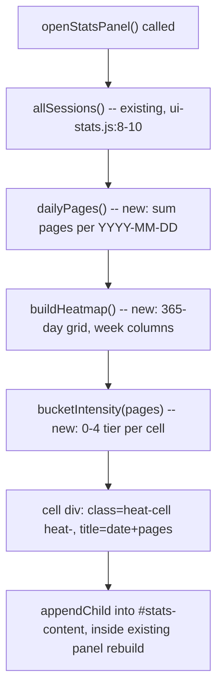

# Streak Heatmap - Plan

## Goal Capsule

- **Objective:** A reader opening the Stats dashboard can see, at a glance, how consistent their reading has been over the past year — which days were light, which were heavy, where the gaps are.
- **Means:** A GitHub-style calendar-grid heatmap appended inside the existing Stats panel, built by aggregating `pages` across every book's `sessions[]` by calendar day (KTD1).
- **Authority hierarchy:** Product Contract (below) constrains Planning Contract; Planning Contract constrains Implementation Units. On conflict, the more specific ID wins per its type (R wins on product behavior, KTD wins on mechanism).
- **Stop conditions:** Any unit that would require a new persisted data model, would touch `js/ui-streak.js`'s counter, or would add a UI framework/build step is out of bounds — stop and flag rather than proceeding.
- **Execution profile:** Solo frontend feature, no external services, no test framework in this repo (see Verification Contract) — verification is manual browser check plus a self-contained sanity script.
- **Tail ownership:** Implementer runs `ce-work` or executes directly; no PR/CI pipeline exists in this repo beyond the Vercel deploy workflow, which is unaffected by this change.

**Product Contract preservation:** changed R4, R6 — see Key Decisions KTD2/KTD3 for why (color scheme and tooltip mechanism corrected against actual repo state found during planning research).

---

## Product Contract

### Summary

A day-by-day activity grid in the Stats dashboard, one year of history, cells colored by pages read that day using the panel's existing orange accent. Built from session dates already logged per book — no new data model required.

### Problem Frame

Libra tracks reading sessions per book (`book.sessions[]`, each `{date, pages, duration}`) and shows a streak badge (current/best consecutive days) via `js/ui-streak.js`. Neither surfaces the *shape* of reading activity over time — which days were light, which were heavy, where the gaps are. A heatmap answers "how consistent has my reading actually been this year," which the streak counter and monthly bar charts don't show.

### Requirements

**Data and aggregation**
- R1. Aggregate activity per calendar day by summing `pages` across every session, across every book, that falls on that day.
- R7. Read directly from `state.booksData[*].sessions[]` — never from or dependent on `js/ui-streak.js`'s stored counter.

**Rendering**
- R2. Render a calendar-grid heatmap (GitHub contribution-graph style) inside the existing Stats panel, alongside the current charts (pages/month, books/month, rating by genre).
- R3. Cover a rolling one-year window (today back 365 days), grid oriented by week columns / day-of-week rows.
- R4. Color each day-cell on a graduated intensity scale (light → full) proportional to that day's total pages, using `var(--neon-orange)` — matching the Stats panel's existing accent color, not a new palette. *(Changed from cyan per KTD2.)*
- R5. A day with zero sessions renders as the grid's empty/idle cell state, visually distinct from the lowest non-zero tier.
- R8. Renders whenever the Stats dashboard is opened, consistent with how the panel already rebuilds its other charts from scratch on every open.

**Interaction**
- R6. Hovering (desktop) shows that day's date and total pages via the native `title` attribute — the same convention the existing bar chart already uses. *(Changed from a custom tooltip per KTD3.)*

### Key Decisions

- **KTD-linked product decisions carried from research** (see Planning Contract KTD2, KTD3 below for the full rationale) — R4 and R6 were corrected in place from the original brainstorm doc after repo research showed the assumptions behind them didn't match the actual codebase.

### Scope Boundaries

- Does not touch or refactor `js/ui-streak.js`'s counter logic, storage key, or the streak badge UI.
- Does not add a dedicated full-screen/standalone heatmap view — lives inside the existing Stats panel only.
- Does not add new persisted state or a new Supabase/localStorage schema.
- Does not change what counts as a "reading session" or how sessions are logged.
- Does not build custom tap/touch tooltip infrastructure — mobile gets the same native-title degradation the rest of the app already has (no `@media (hover)` or `touchstart` handling exists anywhere in the codebase; this feature does not introduce a first instance).

### Success Criteria

- Opening the Stats dashboard shows a 365-day grid where days with logged sessions are visibly shaded, days without are visibly empty, and heavier-page days are visibly darker/brighter than lighter ones.
- Hovering any cell surfaces that day's exact date and page total via the browser's native tooltip.
- Grid reflects sessions from all books, not just a filtered/selected one.

---

## Planning Contract

### Key Technical Decisions

- KTD1. **Aggregate via a `dailyPages()` helper mirroring the existing `pagesPerMonth()` pattern.** `js/ui-stats.js:8-10` already has `allSessions()` (flat-maps every book's `.sessions`) and `js/ui-stats.js:12-21` has `pagesPerMonth()` (buckets by `date.slice(0,7)`, sums `pages`). `dailyPages()` is the same shape keyed on the full `date.slice(0,10)` instead — no new aggregation pattern, no new module. Governs R1, R7.
- KTD2. **Heatmap uses `var(--neon-orange)`, not cyan.** *(session-settled: user-approved — chosen over the brainstorm's original cyan: research found `css/stats.css` themes the entire Stats panel in orange — `.stats-title`, `.stats-section-title`, `.stats-bar` gradients all use `var(--neon-orange)`; cyan would visually clash. User confirmed matching the panel over keeping the original brainstorm color.)* Governs R4.
- KTD3. **Cell hover detail uses the native `title` attribute, not a custom tooltip component.** *(session-settled: user-approved — chosen over building a positioned custom tooltip: research found no tooltip component exists anywhere in the codebase — the only precedent, `js/ui-stats.js:109`, sets `bar.title = "..."` on the existing bar chart. Building custom positioned-tooltip infrastructure would be a new, unprecedented UI pattern for a one-panel feature. User confirmed the native-title path.)* Governs R6.
- KTD4. **Color intensity uses discrete stepped buckets, not a continuous gradient.** GitHub-style heatmaps read as 4-5 distinct tiers, not a smooth ramp; no bucketing helper exists yet in the codebase, so this is new but trivial (`Math.min(4, Math.floor(pages / threshold))`). Governs R4.
- KTD5. **`buildHeatmap()` lives in `js/ui-stats.js`, appended inside `openStatsPanel()`.** Every other Stats chart (`pagesPerMonth`, books/month, rating-by-genre) follows the `build*()` → returns a `
` → appended to `#stats-content` pattern at `js/ui-stats.js:178-193`. The panel already fully rebuilds on every open (no incremental refresh, no separate lifecycle), so the heatmap needs no new init/open/close wiring in `js/app-ui.js` — it is purely an additional `content.appendChild(buildHeatmap())` call.

### High-Level Technical Design

### Assumptions

- The one-year window is a rolling window ending today, not a fixed calendar year (Jan-Dec) — matches GitHub's own convention and avoids an empty grid in January.
- Weeks run Sunday-start, matching GitHub's default layout; no user preference exists for week-start day elsewhere in the app.

---

## Implementation Units

### U1. Daily-pages aggregation helper

- **Goal:** Produce a `{'YYYY-MM-DD': totalPages}` map summing pages across every book's sessions, for the trailing 365 days.
- **Requirements:** R1, R7 (KTD1)
- **Dependencies:** None
- **Files:**
  - `js/ui-stats.js` (add `dailyPages()` near existing `pagesPerMonth()`, `js/ui-stats.js:12-21`)
- **Approach:**
  1. Reuse `allSessions()` (`js/ui-stats.js:8-10`) as the source.
  2. Filter to sessions within the trailing 365 days of today.
  3. Reduce into an object keyed by `date.slice(0,10)`, summing `pages`.
- **Patterns to follow:** `pagesPerMonth()` at `js/ui-stats.js:12-21` — same reduce shape, different key granularity and a date-range filter.
- **Test scenarios:**
  - Two sessions on the same date, different books → pages summed into one entry for that date.
  - A session older than 365 days → excluded from the result.
  - A session dated today → included.
  - No sessions logged anywhere → returns an empty object, not an error.
  - `Test expectation:` covered by the sanity script in Verification Contract, not a unit-test framework (none exists in this repo).
- **Verification:** Calling `dailyPages()` in a browser console against seeded `state.booksData` returns the expected per-date totals for a small hand-checked fixture.

### U2. Intensity bucketing helper

- **Goal:** Map a day's page total to a 0-4 discrete intensity tier (0 = no activity).
- **Requirements:** R4, R5 (KTD4)
- **Dependencies:** U1
- **Files:**
  - `js/ui-stats.js` (add `bucketIntensity(pages)` alongside `dailyPages()`)
- **Approach:**
  1. `pages === 0 || undefined` → tier 0 (idle).
  2. Otherwise `Math.min(4, Math.floor(pages / threshold) + 1)`, threshold chosen so a typical day (worked example: ~20-30 pages) lands in the middle tiers, not maxed on every session.
- **Patterns to follow:** None existing in the codebase (KTD4) — self-contained, small.
- **Test scenarios:**
  - 0 pages → tier 0.
  - 1 page → tier 1 (lowest non-zero, distinct from idle per R5).
  - A very high single-day total (e.g. 300 pages) → clamps at tier 4, does not overflow.
  - Threshold boundary value → lands in the expected tier, not off-by-one into the next.
- **Verification:** Console-check `bucketIntensity()` against a spread of sample page counts, confirm tier assignment matches expectations by inspection.

### U3. `buildHeatmap()` DOM builder

- **Goal:** Build the 365-day grid DOM structure (week columns, day-of-week rows, Sunday-start) with each cell carrying its intensity class and native `title` tooltip.
- **Requirements:** R2, R3, R5, R6 (KTD3, KTD5)
- **Dependencies:** U1, U2
- **Files:**
  - `js/ui-stats.js` (add `buildHeatmap()` following the `build*()` convention used by other Stats sections, e.g. the function building the pages/month chart)
- **Approach:**
  1. Compute the trailing-365-day date list, grouped into weeks starting Sunday (pad the first/last week with empty leading/trailing cells so columns align).
  2. For each day, look up its tier from U1/U2's output.
  3. Build one cell `
` per day, `title` set to `"{date}: {pages} pages"` (or `"{date}: no sessions"` for tier 0) — mirrors `js/ui-stats.js:109`'s `bar.title` convention.
  4. Wrap in a `
` with a `.stats-section-title`, matching every other Stats section's outer shape (`js/ui-stats.js:178-193`).
- **Patterns to follow:** `makeEl(tag, cls, text)` helper (`js/ui-stats.js:61-66`) for DOM construction; existing `build*()` functions for the outer section wrapper shape.
- **Test scenarios:**
  - A month with zero logged sessions → renders 30ish idle cells, no errors.
  - A leap-year boundary (Feb 29 falls inside the trailing year) → date grouping doesn't skip or duplicate the day.
  - First/last partial week of the grid → padding cells render without breaking the column alignment.
  - Cell for a day with sessions → `title` attribute reads `"{date}: {N} pages"` matching the aggregated total from U1.
- **Verification:** Open Stats panel in browser, visually confirm 365 columns-of-days render, hover a populated cell and an idle cell, confirm tooltip text in both cases.

### U4. CSS: heatmap grid, intensity tiers, responsive sizing

- **Goal:** Style the grid layout and the 5 intensity tiers using `var(--neon-orange)`, matching the Stats panel's existing visual language, with a mobile breakpoint.
- **Requirements:** R4, R5 (KTD2, KTD4)
- **Dependencies:** U3
- **Files:**
  - `css/stats.css` (add `.heat-grid`, `.heat-cell`, `.heat-tier-0` through `.heat-tier-4` near the existing `.stats-bar` / `.stats-genre-fill` rules, `css/stats.css:143-215`)
- **Approach:**
  1. `.heat-grid`: CSS grid, columns = weeks, rows = 7 (Sun-Sat), small fixed cell size with gap, matching the app's compact card-glow aesthetic.
  2. `.heat-tier-0`: idle state — subtle background matching `var(--dark-card)`, low-opacity border, visually distinct from any active tier.
  3. `.heat-tier-1` through `.heat-tier-4`: stepped `background-color` opacity/lightness of `var(--neon-orange)`, following the two-layer glow convention used elsewhere (`css/books.css:118-121`, `css/books.css:226`) for the top tier only (full-intensity cells get a subtle glow; lower tiers stay flat to keep the gradient legible).
  4. Extend the existing `max-width: 600px` breakpoint (`css/stats.css:230-233`) to shrink `.heat-cell` size so the grid doesn't overflow narrow viewports.
- **Patterns to follow:** `.stats-bar` gradient (`css/stats.css:143-149`), `.stats-genre-fill` (`css/stats.css:207-211`), glow convention (`css/books.css:118-121`, `css/books.css:226`), existing mobile breakpoint (`css/stats.css:230-233`).
- **Test scenarios:**
  - `Test expectation: none -- pure CSS styling, no behavioral logic; covered by U3's manual visual verification.`
- **Verification:** At desktop width, all 5 tiers are visually distinguishable from each other and from idle. At ≤600px viewport, grid remains legible and doesn't cause horizontal page overflow.

### U5. Wire into `openStatsPanel()`

- **Goal:** Append the heatmap section into the Stats panel's rendered content.
- **Requirements:** R2, R8 (KTD5)
- **Dependencies:** U3, U4
- **Files:**
  - `js/ui-stats.js` (`openStatsPanel()`, `js/ui-stats.js:178-193`)
- **Approach:**
  1. Add one `content.appendChild(buildHeatmap())` call alongside the existing chart appends inside `openStatsPanel()`.
  2. No changes needed in `js/app-ui.js` — the panel's existing open/close/init wiring (`js/app-ui.js:13,28,30`) already covers this since Stats fully rebuilds its content on every open.
- **Patterns to follow:** Existing `content.appendChild(build...())` calls in the same function.
- **Test scenarios:**
  - Opening Stats panel renders the heatmap section alongside the existing three charts, in a stable position, on every open (not just the first).
- **Verification:** Open and close the Stats panel several times in the browser; heatmap appears consistently with no duplicate sections and no stale data after new sessions are logged.

---

## Verification Contract

No test framework exists in this repo (`package.json` has one runtime dependency, `web-push`; no test runner, no `test` script). Verification is manual, browser-based:

| Check | How | Applies to |
|---|---|---|
| Aggregation correctness | Browser console: call `dailyPages()` / `bucketIntensity()` against seeded `state.booksData`, compare to hand-computed expected values | U1, U2 |
| Visual render | Open Stats panel, visually inspect grid renders 365 days, correct week/day alignment | U3 |
| Tooltip content | Hover a populated cell and an idle cell, confirm `title` text matches aggregated data | U3 |
| Color tiers | Visually confirm 5 distinguishable tiers, orange-themed, consistent with rest of panel | U4 |
| Responsive | Resize browser to ≤600px, confirm no horizontal overflow, grid stays legible | U4 |
| Wiring stability | Open/close Stats panel repeatedly, confirm heatmap appears every time with fresh data | U5 |

## Definition of Done

- All five implementation units complete and manually verified per the table above.
- No new persisted data model, no changes to `js/ui-streak.js`.
- `js/app-ui.js` unchanged (per KTD5 — no new wiring needed).
- Any dead-end code from bucketing-threshold experimentation removed before calling this done.
